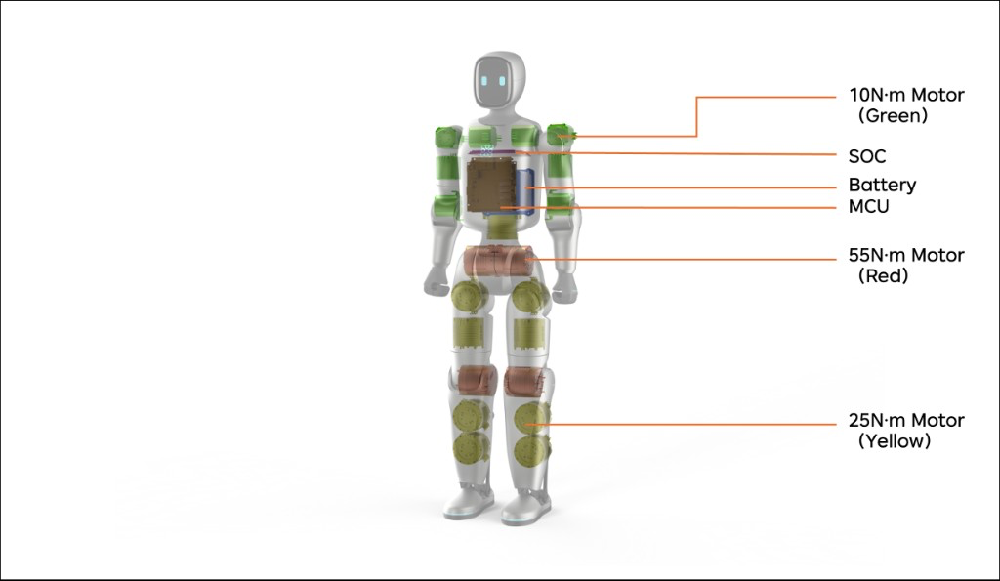
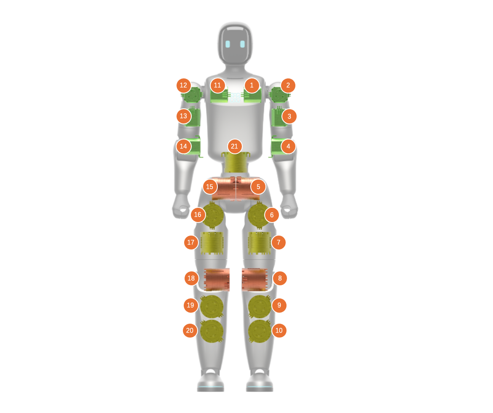
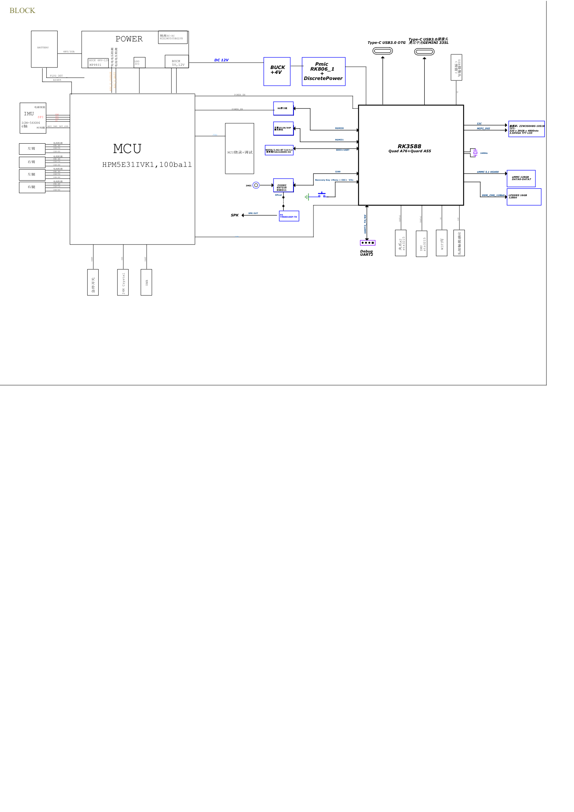

# Robot Hub

Hardware boundary for **Zeroth Bridge** (小桥): drawings, electrical topology, enclosure / interface notes, and printable parts.

OpenBridge is the open-source ecosystem. Zeroth Bridge is the robot.

| Resource | Repository |
| --- | --- |
| Product introduction | [openbridge](https://github.com/Zeroth-OpenBridge/openbridge) |
| Skill development | [Skill Hub](https://github.com/Zeroth-OpenBridge/OpenBridge-Skill-Hub) |
| Simulation and verification | [Simulation Hub](https://github.com/Zeroth-OpenBridge/OpenBridge-Simulation-Hub) |

Document version: V1.1.1  
Hardware snapshot: **2026-09-02** (`mechanical/20260902/`)  
Applicable model: 小桥 / Zeroth Bridge  
Units: SI (cm, kg, N·m)  
License: [GNU General Public License v3.0](LICENSE) — 元点机器人 / OpenBridge

---

## Contents

1. [Repository layout](#repository-layout)
2. [Print quickstart](#print-quickstart)
3. [Parts snapshot 2026-09-02](#parts-snapshot-2026-09-02)
4. [Mechanical structure](#mechanical-structure)
5. [Specifications](#specifications)
6. [Degrees of freedom](#degrees-of-freedom)
7. [Electrical topology](#electrical-topology)
8. [Assembly](#assembly)
9. [Known limits](#known-limits)
10. [Issues and pull requests](#issues-and-pull-requests)
11. [License](#license)

---

## Repository layout

```
OpenBridge-Robot-Hub/
├── README.md
├── CHANGELOG.md
├── LICENSE
├── images/                      README figures (regular Git files, not LFS)
│   ├── 2.2-electrical-topology.png
│   ├── 4.1-structure.png        body structure diagram
│   └── 4.1-joints.png           joint index / motor layout
├── mechanical/
│   └── 20260902/                hardware snapshot 2026-09-02
│       ├── VERSION
│       ├── Zeroth_Bridge_assembly_20260902.step.zip
│       ├── head/
│       ├── torso/
│       ├── waist/
│       ├── left_arm/
│       ├── right_arm/
│       ├── left_leg/
│       ├── right_leg/
│       └── foot/
├── electrical/                  topology and wiring
│   └── electrical-topology.pdf  source diagram from the open-source prep doc
└── assembly/                    assembly and fastener notes
```

| Path | Status | What belongs here |
| --- | --- | --- |
| `mechanical/20260902/` | Published | Printable STL by body region, structural members, and zipped STEP assembly (snapshot 2026-09-02) |
| `electrical/` | Topology PDF published | Electrical topology and later wiring / pinout notes |
| `assembly/` | Placeholder | Assembly sequence and fasteners |
| `images/` | Published | Figures used by this README |

Later hardware drops use a new dated folder (`mechanical/YYYYMMDD/`) so snapshots stay side by side.

---

## Print quickstart

Current parts: [`mechanical/20260902/`](mechanical/20260902/). Left / right parts use `_L` / `_R`. Files named `structure_*` are structural members (series **1** foot, **2** shank, **3** thigh, **4–5** waist, **6** arm).

Print **TPU** for:

- Chest enclosure — `torso/body_front_shell.stl`, `torso/body_rear_shell.stl` (soft chest shell)
- `head/neck_tpu.stl`
- `torso/logo_tpu.stl`
- `foot/foot_sole_tpu.stl`

Slicer profiles and remaining material assignments are not in this revision.

Coming soon. Expected update in September.

---

## Parts snapshot 2026-09-02

Full-body STEP (zipped, about 28 MB): [`Zeroth_Bridge_assembly_20260902.step.zip`](mechanical/20260902/Zeroth_Bridge_assembly_20260902.step.zip). Uncompressed STEP (134 MB): [Releases](https://github.com/Zeroth-OpenBridge/OpenBridge-Robot-Hub/releases/tag/hardware-2026.09.02).

| Region | Path | Files |
| --- | ---: | --- |
| Head | [`head/`](mechanical/20260902/head/) | 9 STL |
| Torso | [`torso/`](mechanical/20260902/torso/) | 18 STL |
| Waist | [`waist/`](mechanical/20260902/waist/) | 11 STL |
| Left arm | [`left_arm/`](mechanical/20260902/left_arm/) | 17 STL |
| Right arm | [`right_arm/`](mechanical/20260902/right_arm/) | 18 STL |
| Left leg | [`left_leg/`](mechanical/20260902/left_leg/) | 24 STL + 1 PRT |
| Right leg | [`right_leg/`](mechanical/20260902/right_leg/) | 21 STL |
| Foot | [`foot/`](mechanical/20260902/foot/) | 9 STL |
| Assembly | [`Zeroth_Bridge_assembly_20260902.step.zip`](mechanical/20260902/Zeroth_Bridge_assembly_20260902.step.zip) | 1 ZIP |

Filenames match the part names (English). `_L` / `_R` is side. Browse each folder for the full list.

---

## Mechanical structure

Zeroth Bridge is a compact humanoid with a slender body. Key dimensions and mass follow the [specification table](#specifications) (85 cm / about 10 kg). The chest shell is soft TPU.

**Body structure diagram**

<p align="center">
  
</p>

Callouts on the cutaway:

- **10 N·m motor** (green) — shoulders and arms
- **SOC** — upper chest, below the neck
- **Battery** — blue pack in the torso
- **MCU** — chest controller board
- **55 N·m motor** (red) — hips and knees
- **25 N·m motor** (yellow) — thighs and ankles

**Joint range of motion and motor parameters**

<p align="center">
  
</p>

Orange tags **1–21** index joints: **1–4 right arm, 5–10 right leg, 11–14 left arm, 15–20 left leg, 21 waist.** Peak torques for each region are in the [DoF table](#degrees-of-freedom).

| # | Joint | Lower (deg) | Lower (rad) | Upper (deg) | Upper (rad) | Torque (N·m) | Speed (rpm) | Speed (rad/s) |
| --- | --- | ---: | ---: | ---: | ---: | ---: | ---: | ---: |
| 1 | right_shoulder_pitch | -210 | -3.6652 | 90 | 1.5708 | 10 | 235 | 24.6091 |
| 2 | right_shoulder_roll | -180 | -3.1416 | 10 | 0.1745 | 10 | 235 | 24.6091 |
| 3 | right_shoulder_yaw | -90 | -1.5708 | 90 | 1.5708 | 10 | 235 | 24.6091 |
| 4 | right_elbow_pitch | -45 | -0.7854 | 225 | 3.927 | 10 | 235 | 24.6091 |
| 5 | right_hip_pitch | -160 | -2.7925 | 160 | 2.7925 | 55 | 180 | 18.8496 |
| 6 | right_hip_roll | -80 | -1.3963 | 90 | 1.5708 | 25 | 170 | 17.8024 |
| 7 | right_hip_yaw | -160 | -2.7925 | 160 | 2.7925 | 25 | 170 | 17.8024 |
| 8 | right_knee_pitch | -100 | -1.7453 | 120 | 2.0944 | 55 | 180 | 18.8496 |
| 9 | right_ankle_pitch | -40 | -0.6981 | 40 | 0.6981 | 25 | 170 | 17.8024 |
| 10 | right_ankle_roll | -28 | -0.4887 | 28 | 0.4887 | 25 | 170 | 17.8024 |
| 11 | left_shoulder_pitch | -210 | -3.6652 | 90 | 1.5708 | 10 | 235 | 24.6091 |
| 12 | left_shoulder_roll | -10 | -0.1745 | 180 | 3.1416 | 10 | 235 | 24.6091 |
| 13 | left_shoulder_yaw | -90 | -1.5708 | 90 | 1.5708 | 10 | 235 | 24.6091 |
| 14 | left_elbow_pitch | -45 | -0.7854 | 225 | 3.927 | 10 | 235 | 24.6091 |
| 15 | left_hip_pitch | -160 | -2.7925 | 160 | 2.7925 | 55 | 180 | 18.8496 |
| 16 | left_hip_roll | -90 | -1.5708 | 80 | 1.3963 | 25 | 170 | 17.8024 |
| 17 | left_hip_yaw | -160 | -2.7925 | 160 | 2.7925 | 25 | 170 | 17.8024 |
| 18 | left_knee_pitch | -100 | -1.7453 | 120 | 2.0944 | 55 | 180 | 18.8496 |
| 19 | left_ankle_pitch | -40 | -0.6981 | 40 | 0.6981 | 25 | 170 | 17.8024 |
| 20 | left_ankle_roll | -28 | -0.4887 | 28 | 0.4887 | 25 | 170 | 17.8024 |
| 21 | waist_yaw | -155 | -2.7053 | 155 | 2.7053 | 25 | 170 | 17.8024 |

---

## Specifications

| Key spec | Value | Notes |
| --- | --- | --- |
| Overall height | 85 cm | ~80 cm-class small humanoid; suited to demonstrations, education, teleoperation, and small-object interaction |
| Shoulder height | 73 cm | Suited to low tabletops, children's desks, and near-floor motion demos; not suited to fine manipulation at adult kitchen counters |
| Hip / base height | 50 cm | Sets gait center of mass, fall height, and safety-test bounds |
| Leg length | ~50 cm | Structural segment length affects routing, enclosure, and mechanical stacking; Z-axis projected length affects standing height and gait |
| Arm length | 30–40 cm, two-finger gripper | Short-arm motion demo / teleoperation platform |
| Shoulder width | 13 cm between joint centers | Controlled without sacrificing self-collision clearance |
| Overall mass | ~10 kg | Lightweight, highly dynamic |

---

## Degrees of freedom

| Body region | Joint | DoF | Peak torque |
| --- | --- | --- | --- |
| Arms | Shoulder up/down | 1 | 10 N·m |
|  | Shoulder front/back | 1 | 10 N·m |
|  | Shoulder in/out | 1 | 10 N·m |
|  | Elbow up/down | 1 | 10 N·m |
| Waist | Waist rotation | 1 | 25 N·m |
| Legs | Hip | 1 | 55 N·m |
|  | Thigh | 2 | 25 N·m |
|  | Knee | 1 | 55 N·m |
|  | Ankle | 2 | 25 N·m |

---

## Electrical topology

Original file: [`electrical/electrical-topology.pdf`](electrical/electrical-topology.pdf). On-diagram labels mix English part names and Chinese limb names; the figure is unchanged.

<p align="center">
  
</p>

Two compute domains share the body:

- **MCU** (HPM5E31IVK1) — real-time motion. Dedicated buses to left arm, right arm, left leg, and right leg; IMU on SPI/I2C; crystal, USB, and a programming/debug path toward the SoC.
- **SoC** (RK3588, quad-core A76 + quad-core A55) — application compute. LPDDR5 16 GB, eMMC 128 GB (HS400), LCD (320×384 @ 60 Hz), audio codec ES7210 / ES8311 to speaker, Wi-Fi/BT, USB 3.0 Type-C OTG, Type-C for GEMINI 335L, debug UART2, fan control, and a 9-axis gyro link.

MCU and SoC exchange data over dual **RGMII** links. Battery power goes through a **12 V buck**; the MCU rail set is 12 V / 5 V / 3.3 V; the SoC path is 12 V → buck +4 V → PMIC RK806 plus discrete regulators.

---

## Assembly

Coming soon. Expected update in September.

---

## Known limits

- Current sensing is IMU plus motor-internal feedback. LiDAR and cameras are not fitted; hardware interfaces are reserved.
- Collision energy is lower than a hard enclosure, but this is still a high-dynamic ~10 kg machine.
- Arm reach is short (30–40 cm). Not intended for fine work at adult kitchen-counter height.
- Fasteners and assembly steps are not published in this revision. Printable STL and the STEP assembly are in `mechanical/20260902/`.

If you build or modify a complete robot yourself, assess close-to-people use and high-dynamic motion risk on your own.

---

## Issues and pull requests

Use [GitHub Issues](https://github.com/Zeroth-OpenBridge/OpenBridge-Robot-Hub/issues) for defects, missing files, and doc gaps. Pull requests should stay scoped (one drawing set, one electrical note, or one README fix). Do not commit secrets or files over 100 MB; attach those to Releases.

Each public release is recorded in [CHANGELOG.md](CHANGELOG.md) and tagged.

---

## License

[GNU General Public License v3.0](LICENSE). Copyright 2026 元点机器人 / OpenBridge.
